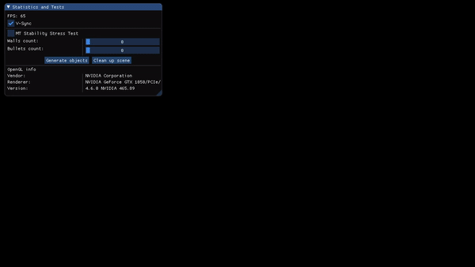

# Bulletshot

2d graphics visualization of bullets and walls collisions.

## Getting Started
Windows and Visual Studio 2019 tested only.

You can clone repository using git (**`--recursive`** is required to fetch all of the submodules):

`git clone --recursive https://github.com/kryvytskyidenys/ElvenEngine`

Run vs2019-Win-GenProject.bat file from the scripts folder to build the solution.

## Third party libraries
| Lib | |
| ------ | ------ |
| [premake](https://github.com/premake/premake-core) | build configuration |
| [GLFW](https://github.com/kryvytskyidenys/glfw) | windows, OpenGL contexts and handle input |
| [Glad](https://glad.dav1d.de/) | OpenGL loader |
| [Deat ImGui](https://github.com/kryvytskyidenys/imgui) | library using for GUI |
| [GDM](https://github.com/kryvytskyidenys/gdm) | my custom 3D mathematics library |

## Demo

